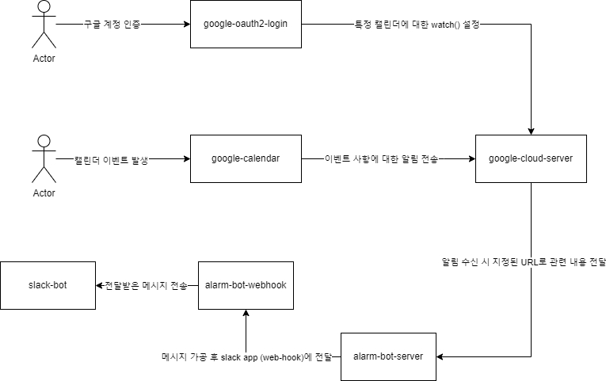

# Calendar Bot

---

> 구글 캘린더 알림 봇
> 

# 개요

기존에 슬랙에서 제공하던 google calendar bot의 경우 해당 채널 내 모든 사용자에게 알림이 전달되며 일정을 모두가 확인할 수 있었으나, 현재는 개별적으로 app 설정을 통해 진행해야되며 특정 채널에서 모두와 공유할 수 없기에 하나 만들기로 함

# 요구사항

- 구글 캘린더 내 일정 생성 시 알림 전송
- 구글 캘린더 내 일정에 대해 시작전 30분 전에 알림 전송
    - 해당 일정이 종일일 경우 전날 16시에 알림 전송
- 캘린더를 선택하여 알림 여부 지정 가능 (옵션)

# 사용자 시나리오

1. 구글 계정 인증
2. 알림을 원하는 캘린더에 대한 알림 지정 및 webhook url 지정
3. 이후 발생하는 이벤트에 대한 알림 수신 및 가공
4. 가공된 알림에 대한 slack webhook 전달 및 slack app 알림