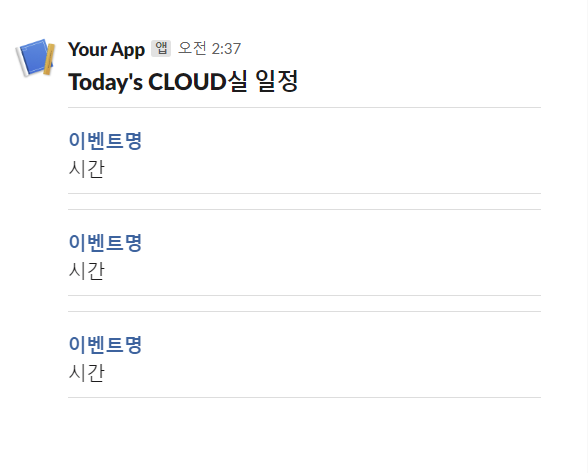

# Calendar Bot

---

> 구글 캘린더 알림 봇
> 

# 개요

기존에 슬랙에서 제공하던 google calendar bot의 경우 해당 채널 내 모든 사용자에게 알림이 전달되며 일정을 모두가 확인할 수 있었으나, 현재는 개별적으로 app 설정을 통해 진행해야되며 특정 채널에서 모두와 공유할 수 없기에 하나 만들기로 함

# 요구사항

- 구글 캘린더 내 일정 생성 시 알림 전송
- 매일 오전 8시에 당일에 지정된 이벤트 목록 전송
- 구글 캘린더 내 일정에 대해 시작 30분 전에 알림 전송
- ~~캘린더를 선택하여 알림 여부 지정 가능 (옵션)~~

# 설계 구조


calendar-alarm-bot 설계 구조

1. google 로그인 및 지정할 캘린더 정보 설정
2. 지정된 캘린더에 따른 스케줄링 시작 (매일 오전 8시 트리거)
3. 실행 시점에 구글 캘린더 api를 통해 당일 시작되는 이벤트 목록 반환
4. 반환받은 이벤트 항목을 slack에 알맞게 가공하여 slack webhook으로 전달
5. webhook을 통해 넘어온 메시지 출력

# 실행 환경 변수

- `GOOGLE_OAUTH2_KEY` : 구글 로그인 관련 key
- `GOOGLE_OAUTH2_SECRET` : 구글 로그인 관련 secret
- `SLACK_WEBHOOK_URL` : 알림 수신용 Slack webhooh url

# 알람 설정 정보

```json
{ 
	"calendarId" : "알림 지정할 캘린더 id",
	"accessToken" : "로그인 된 사용자의 token"
}
```

1. 사용자가 web화면에서 알림을 수신할 id 지정

# 슬랙 메시지 포멧

## preview



## format

```json
{
	"blocks": [
		{
			"type": "header",
			"text": {
				"type": "plain_text",
				"text": "Today's CLOUD실 일정"
			}
		},
		{
			"type": "divider"
		},
		{
			"type": "section",
			"text": {
				"type": "mrkdwn",
				"text": "*<https://google.com|이벤트명>*\n시간"
			}
		},
		{
			"type": "divider"
		},
		{
			"type": "divider"
		},
		{
			"type": "section",
			"text": {
				"type": "mrkdwn",
				"text": "*<https://google.com|이벤트명>*\n시간"
			}
		},
		{
			"type": "divider"
		},
		{
			"type": "divider"
		},
		{
			"type": "section",
			"text": {
				"type": "mrkdwn",
				"text": "*<https://google.com|이벤트명>*\n시간"
			}
		},
		{
			"type": "divider"
		}
	]
}
```